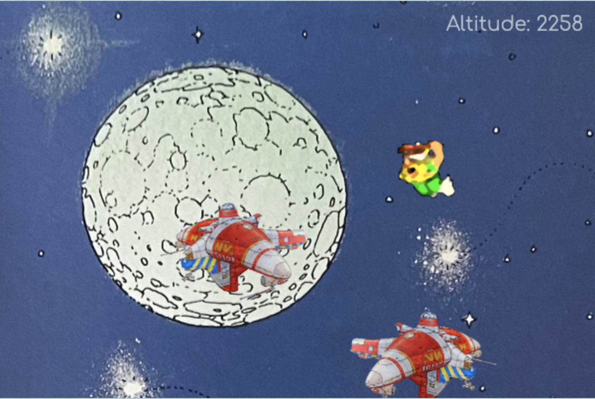

# Oleg’s Escape

[Play game!](https://helenedwards.github.io/Olafs-Escape/ "Olaf's Escape")

## Background 

Based on a character from the Blizzard Classic, The Lost Vikings, this game follows Oleg, a shield-bearing Viking, who recently escaped imprisonment from aliens on their spaceship.  He is free of their custody but is still on their ship!  He must use his mighty shield as a glider to make his way safely to the ground.  He needs your to help to avoid obstacles on his way down.



## Functionality & MVPs

In Oleg’s Escape, users will be able to:
-   Start the game
-	Use computer keys to navigate left and right on the screen 
-	Use navigation to avoid obstacles as they appear on screen
-	View how far they are from the ground on an altitude reader
-	Win or lose the game

In addition, this project will include:
-	Background information on the game, including the rules
-	A legend of keys used for gameplay
-	A production readme 


## Wireframes


## Technologies

-	Canvas
-	Webpack
-	JavaScript
-	HTML, CSS

## Code Snippet - Call to animate game

One tricky part of this project was figuring out where and in what order to animate.  I initially made each class control it's own animation, which was a big mistake.  Even though the classes all moved in different ways, there was a lot of redundant code, and stopping the animation on game over was also impossible to disperse to each of the classes from the game class.  I rewrote all that code here in 3 steps - drawing the classes, checking for collisions, then moving the objects.  

```javascript
animate(){
    //draw all classes
    this.ctx.clearRect(0, 0, 600, 400)
    this.ctx.drawImage(this.background.img, 0, this.background.y, 1200, 3500, 0, 0, 600, 1771);
    this.drawAltitude()
    this.ctx.drawImage(this.mothership.img, 400, this.mothership.y, this.mothership.width, this.mothership.height )
    this.ctx.drawImage(this.player.img, this.player.x, this.player.y, this.player.width, this.player.height)
    this.enemies.forEach(enemy => {
         this.ctx.drawImage(enemy.img, enemy.x, enemy.y, enemy.width, enemy.height)
    })

    //move all classes
    this.background.move()
    if (this.background.y >= 2500) {
        this.gameWon()
        return 
    } 
    this.altitude -= this.altitudeSpeed

    // checks for collision before making the next animation frame
    if (this.gameOver === false){
    if (this.collidesWith()) {
        this.gameOver = true
        this.gameLost()
        this.running = false
        return
    } else {
        this.enemies.forEach(enemy => enemy.move())
        this.mothership.move()
        this.player.move()
        window.requestAnimationFrame(this.animate.bind(this))
    }
}```


## Implementation Timeline

**Day 1:** - General setup, canvas research, sprite research
-   Create canvas, basic HTML structure

**Day 2:** - Implement background, create Player class 
-	Render background, animate for descent 
-   Create player, allow player to move left / right
-	Create start position

**Day 3:** – Create Enemies, start Collision Detection
-   Create enemies and randomly generate them on the game board
-   Start collision work

**Day 4:** - Complete Collision Detection 

**Day 5:** – Work on game logic
-	Altitude tracker
-	Start
-	Win / lose

**Day 6:** – Add animation
-   Test and Deploy on GitHub Pages


## Bonus – future features
-  Replace player image with animated sprites
-  Add pause
-  2 speeds for difficulty
-  Extra points can be gained from picking up prizes on the way down. 
-  Multiple levels
